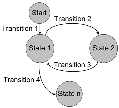

---
testspace:
title: Syntax Examples
---

  

# {{ spec.title }}
Some basic sytax reference examples.

## Lists

Unordered:
* One
* Two
* Three

Ordered:
1. One
3. Two
2. Three

## Styling 

* **Bold**
* *Italic*
* ~~strikethrough~~
* **Bold and _italic_**

## Code Block

```
$ testspace results
```

## Blockquotes

> Beware of this and that

## Table 

c1  | c2 
----|----
one | two
one | two 

## Image



## Emoji
Based on [GitHub Markdown flavor](https://help.github.com/en/github/writing-on-github/basic-writing-and-formatting-syntax#using-emoji). Here is the [Emoji Cheat Sheet](https://www.webfx.com/tools/emoji-cheat-sheet/) reference. 

Add by typing `:EMOJICODE:`. 

:relaxed:

:eyes:

:+1:
